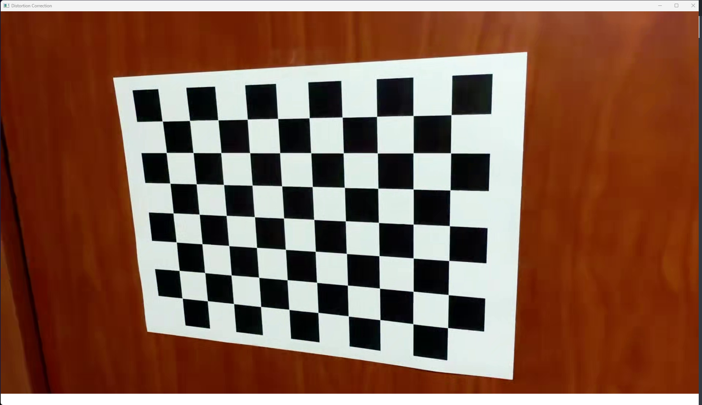
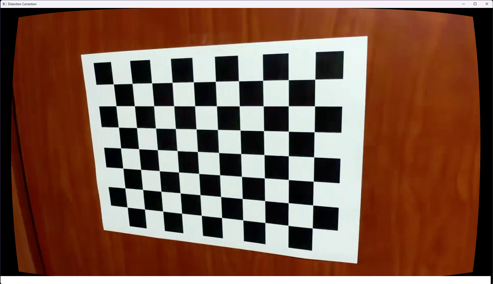
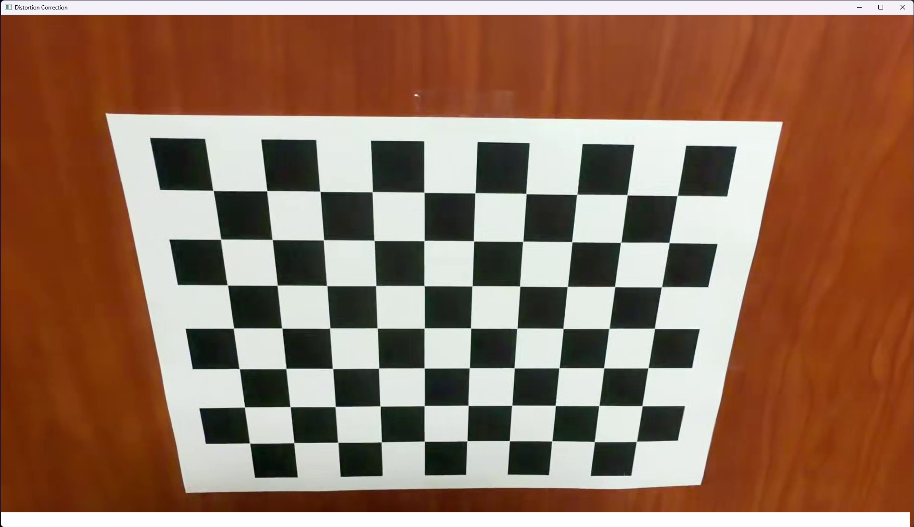
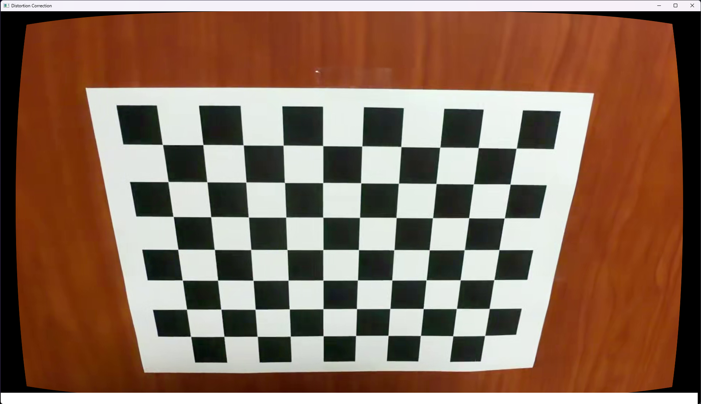
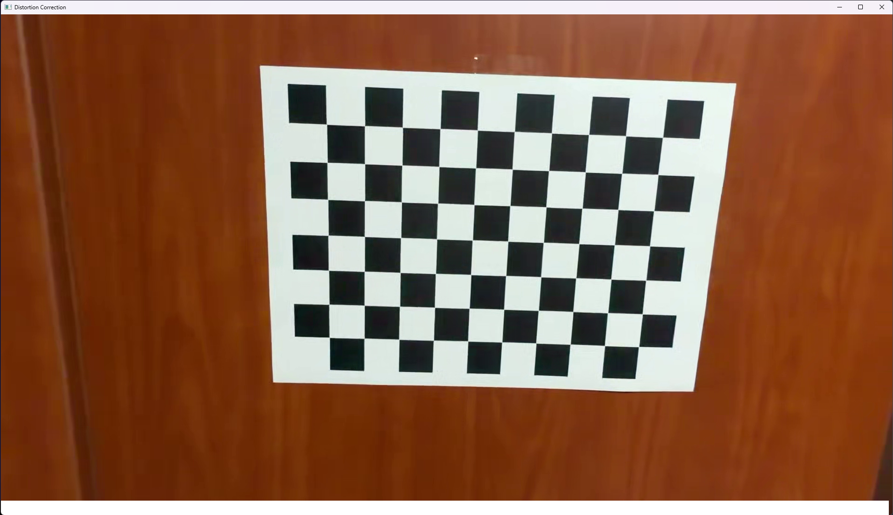
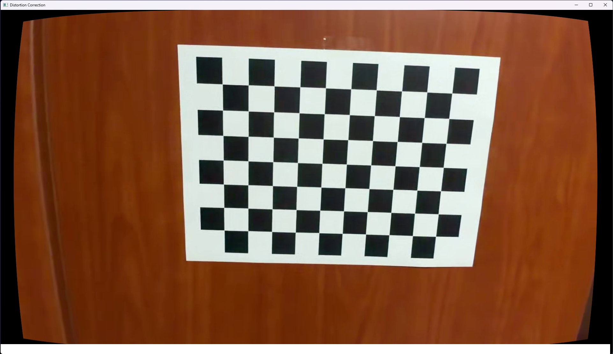

# seoultech-computervision-camera-calibration

(컴퓨터비전 5주차 과제) 카메라 캘리브레이션 및 왜곡 보정

## 개요

다양한 각도에서 촬영되어 왜곡된 체스보드를 카메라 캘리브레이션을 사용하여 보정한 결과를 보여준다.

## 사용법

1) [체스보드 이미지](https://markhedleyjones.com/projects/calibration-checkerboard-collection)를 인쇄 후 바닥 또는 벽면과 같이 평평만 곳에 부착한다. 이 때 인쇄된 종이가 휘어지거나 구겨지지 않도록 한다.

2) 휴대폰 카메라 등을 사용하여 다음과 같은 주의사항에 따라 동영상 촬영한다.
    - 촬영 중에 카메라의 위치 또는 체스보드의 위치 중 하나는 고정한다.
    - 체스보드의 패턴이 넓은 영역을 차지하도록 한다.

3) `video` 폴더에 저장 후 `config.py`의 `App.VIDEO_FILENAME`을 해당 파일명으로 수정한다.

4) `app.py` 파일을 실행한다.

5) 콘솔에 `1`을 입력하여 Camera Calibration 프로그램을 실행한다.

6) 카메라 캘리브레이션에 사용할 이미지를 `A`키를 통해 추가한다. 이 때 정확도를 위해 10장 이상이 권장된다. 또한 `R`키를 통해 저장된 모든 이미지를 초기화할 수 있다.

7) `Enter`키를 입력하여 이전에 추가한 이미지를 사용하여 카메라 캘리브레이션 연산을 수행 후 결과를 저장 및 콘솔에 출력한다.

8) `ESC`키를 입력하여 Camera Calibration 프로그램을 종료 후 콘솔에 `2`를 입력하여 Distortion Correction 프로그램을 실행한다.

9) Distortion Correction 프로그램에서 이전에 얻은 캘리브레이션 결과를 사용하여 보정한 동영상을 확인한다.

## 조작키

### Console

- `0`: 프로그램 종료
- `1`: Camera Calibration 프로그램 실행
- `2`: Distortion Correction 프로그램 실행

### Camera Calibration

- `ESC`: 현재 프로그램 종료
- `Space`: 비디오 정지/재생
- `Enter`: 카메라 캘리브레이션 연산 및 결과 출력
- `A`: 이미지 리스트에 현재 프레임 추가
- `R`: 이미지 리스트 초기화

### Distortion Correction

- `ESC`: 현재 프로그램 종료
- `SPACE`: 비디오 정지/재생
- `Enter`: 왜곡 보정 켜기/끄기

## 결과

`./video/Checkerboard-A4-25mm-10x7.mp4` 비디오에서 25장의 이미지를 선택하여 카메라 캘리브레이션 수행 및 왜곡 보정한 결과이다.

### 카메라 캘리브레이션 결과

캘리브레이션 연산 결과는 아래 파일에 저장된다.

- 파일 경로: `data/camera_calibration_data.json`
- 저장 항목: `rmse`, `mtx`, `dist`, `rvecs`, `tvecs`

| 항목 | 값 |
| --- | --- |
| RMSE (Reprojection Error) | `0.7158 px` |
| `fx` | `1266.0886` |
| `fy` | `1265.3970` |
| `cx` | `965.9942` |
| `cy` | `544.1912` |

**카메라 행렬 K**

```text
[[1266.0886,    0.0000, 965.9942],
 [   0.0000, 1265.3970, 544.1912],
 [   0.0000,    0.0000,   1.0000]]
```

**왜곡 계수 d** (`k1, k2, p1, p2, k3`)

```text
[0.04437, -0.08117, 0.00208, -0.00088, 0.33324]
```


### 왜곡 보정 전/후 비교

| 왜곡 보정 전 | 왜곡 보정 후 |
| --- | --- |
|  |  |
|  |  |
|  |  |